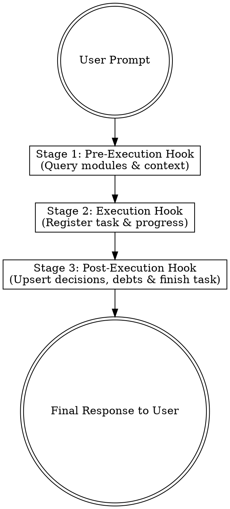

# Managing System Context

## Overview

A structured, database-backed knowledge and task persistence system for AI agents. It ensures persistent memory across sessions, eliminates monolithic documentation bloat, and enforces strict token-efficient context retrieval (concise English summaries <= 250 characters per item).

## When to Use

- At the **very start of every prompt** or task before answering, investigating, or writing code.
- When working on new projects (greenfield) to log requirements, domain models, and architecture decisions.
- When working on existing codebases (brownfield) to scan, partition, and retrieve module architecture, current behaviors, and technical debt.
- At the **end of every task** to update task progress (`01/25`), log new decisions/debts, and close active tasks.

## The Three-Stage Agent Protocol

Every interaction MUST execute the three stages in order:



---

### Stage 1: Pre-Execution Hook (Context Loading)

Before writing any code or answering complex architecture queries:

1. **List Modules**:
   ```bash
   node .agents/skills/managing-system-context/scripts/context-cli.mjs list-modules
   ```
   *Consumes ~30 tokens. Returns existing modules and item counts.*

2. **If database is empty:**
   - **For existing projects (brownfield)**: Run initial discovery scan:
     ```bash
     node .agents/skills/managing-system-context/scripts/bootstrap-scan.mjs --import --db-path .agents/context.db
     ```
   - **For new projects (greenfield)**: Initialize database and record user requirements:
     ```bash
     node .agents/skills/managing-system-context/scripts/context-cli.mjs init
     ```

3. **Query Relevant Module**:
   ```bash
   node .agents/skills/managing-system-context/scripts/context-cli.mjs query --module <module_name>
   ```
   *Returns concise English summaries (max 250 chars) of architecture decisions, current behavior, and technical debt.*

4. **On-Demand Deep Dive (Only if necessary)**:
   If a specific record requires full design specifications or code snippets:
   ```bash
   node .agents/skills/managing-system-context/scripts/context-cli.mjs get <ID>
   ```

---

### Stage 2: Execution Hook (Task Tracking)

1. **Start the Active Task**:
   ```bash
   node .agents/skills/managing-system-context/scripts/context-cli.mjs task-start --module <module_name> --desc "<brief user request>"
   ```
   *Returns the generated `id` (e.g. `TASK-M3K9...`).*

2. **Update Steps During Complex Operations**:
   ```bash
   node .agents/skills/managing-system-context/scripts/context-cli.mjs task-step --id <TASK_ID> --step "Created database schema and migration"
   ```

---

### Stage 3: Post-Execution Hook (Persistence & Closure)

Before delivering your final response to the user:

1. **Record New Architecture Decisions or Technical Debt**:
   If your implementation introduced or identified architecture choices, schema changes, or debt:
   ```bash
   node .agents/skills/managing-system-context/scripts/context-cli.mjs upsert \
     --id "AUTH-DEC-002" \
     --module "auth" \
     --feature "oauth2" \
     --type "architecture_decision" \
     --phase "in_progress" \
     --progress "02/10" \
     --summary "OAuth2 Google provider integration using PKCE flow." \
     --details "Full implementation details and redirect URI config."
   ```

2. **Mark Task Finished**:
   ```bash
   node .agents/skills/managing-system-context/scripts/context-cli.mjs task-finish --id <TASK_ID> --status DONE
   ```

---

## Data Model & Constraints

### Summary Field Constraints
- **Language**: MUST be in **English** (consumes fewer tokens).
- **Length**: Maximum of **250 characters**. The CLI will strictly reject any input exceeding 250 characters. Keep it brief, factual, and actionable.

### Valid Enum Values

| Field | Permitted Values |
|---|---|
| `knowledge_type` | `architecture_decision`, `system_model`, `current_behavior`, `future_revision`, `technical_debt` |
| `phase` | `implemented`, `in_progress`, `queued`, `deprioritized` |
| `tasks_progress` | `XX/YY` (e.g. `01/25`) — required when `phase = in_progress` |
| `status` (tasks) | `PLANNED`, `IN_PROGRESS`, `DONE`, `BLOCKED` |

---

## Database Configuration

The database backend is completely abstracted via `context-cli.mjs`:

1. **Default (Zero-Config SQLite)**:
   - File location: `.agents/context.db`
   - Uses Node.js 24 native `node:sqlite`. No external dependencies or installation required.

2. **Custom Location or Remote DB**:
   - Set environment variables or pass flags:
     - `--db-path <path>` or `CONTEXT_DB_PATH=<path>`
     - `--project <id>` or `PROJECT_ID=<name>`
   - To connect to remote services (e.g. Supabase, PostgreSQL), configure connection credentials in `.env`.

---

## Rationalization Table

| Rationalization | Reality |
|---|---|
| "The task is simple, I don't need to load context." | Simple tasks frequently violate unwritten architecture constraints. Always query the module. |
| "I'll update the database on the next turn." | Next turns lose working memory. Run post-execution upserts immediately before closing. |
| "250 characters is too short to explain." | Use `summary` for the high-level fact (<250 chars) and pass detailed rationale to `--details`. |
| "I can write summaries in Portuguese." | English tokenization consumes 30-50% fewer tokens, maximizing context efficiency. |

## Red Flags - STOP and Correct

- Proceeding to answer or code without running `list-modules` or `query`.
- Storing verbose multi-paragraph explanations in `summary` instead of `details`.
- Ending a conversation turn without finishing the active task via `task-finish`.
- Hardcoding database connection strings inside conversation chat turns.
