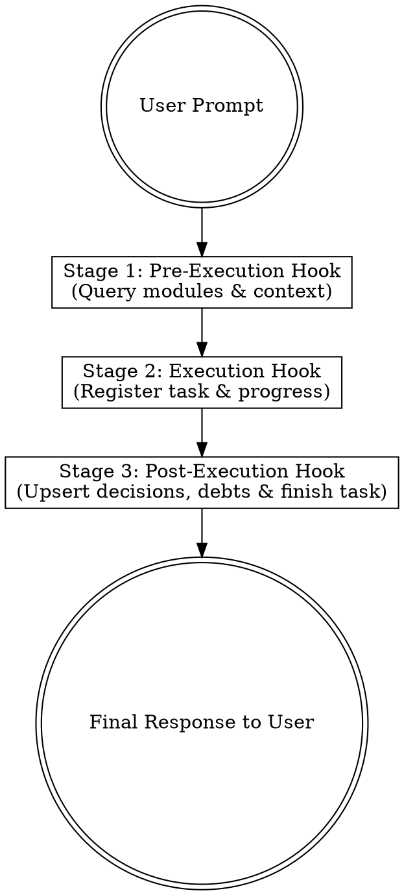

# Managing System Context

## Overview

A structured, database-backed knowledge and task persistence system for AI agents. It ensures persistent memory across sessions, eliminates monolithic documentation bloat, and enforces strict token-efficient context retrieval (concise English summaries <= 250 characters per item).

## When to Use

- At the **very start of every prompt** or task before answering, investigating, or writing code.
- When working on new projects (greenfield) to log requirements, domain models, and architecture decisions.
- When working on existing codebases (brownfield) to scan, partition, and retrieve module architecture, current behaviors, and technical debt.
- At the **end of every task** to update task progress (`01/25`), log new decisions/debts, and close active tasks.

## On-Screen Step Announcements

Every stage MUST be announced to the user in plain text **before** its command runs, using exactly these labels so the user can follow the protocol on screen:

| Stage | Label to print | When |
|---|---|---|
| 1 | `Etapa 1/3 · Contexto` | before `list-modules` / `query` |
| 2 | `Etapa 2/3 · Tarefa` | before `task-start`; on `task-step` print the step text |
| 3 | `Etapa 3/3 · Encerramento` | before `upsert` / `task-finish` |

Example: `Etapa 2/3 · Tarefa — abrindo TASK para o módulo louza_fe`. The Claude Code hooks (see below) echo the same labels as system messages, so the two views stay aligned.

## Target Selection (`--project`)

- Always pass `--project <id>`. The knowledge base holds one row set per project (`louza`, `qlave`, `qoincamera`, `qoinpass`, `qoinmsg`, `qoinpay`, `qpoker`, `qoinstore`, `qoinsite`, `qoinmodel`, `qoinreviews`, `projetos`); the default is the working-directory basename, which is usually wrong from a sub-folder.
- **The CLI talks to the shared API by default** — `https://api.takius.com.br/v1/context`, PostgreSQL `agent_context` on the Takius server. No `--api-url` needed; set `CONTEXT_API_TOKEN` (the API answers 401 without it).
- `.agents/context.db` is now only a **read-only cache**, refreshed by `context-cli.mjs pull`. When the API is down, reads fall back to it with a warning on stderr and **writes fail loudly** — that is deliberate: writing locally would fork the shared memory in silence. `--no-api` forces the local file for both, and is an explicit offline decision, not a workaround for an outage.

## Enforcement via Claude Code Hooks

`scripts/hooks/` ships four zero-dependency hooks wired in the project's `.claude/settings.json`:

| Hook | Event | Effect |
|---|---|---|
| `on-prompt.mjs` | `UserPromptSubmit` | Detects the project from `cwd`, runs `list-modules` (API, then local), injects the protocol + module list as context, shows `Etapa 1/3` on screen |
| `on-edit-guard.mjs` | `PreToolUse` on `Edit\|Write\|NotebookEdit` | **Denies** file edits until a `task-start` was observed in the session (files under `.agents/`, `.claude/` and `CLAUDE.md` are exempt) |
| `on-cli-call.mjs` | `PostToolUse` on `Bash\|PowerShell` | Watches `context-cli.mjs` calls, records open/finished tasks per session, prints the stage of each call |
| `on-stop.mjs` | `Stop` | **Blocks the end of the turn** while a task is open and sends the `task-finish` instruction back to the agent |

Session state lives in `<tmpdir>/claude-context-hooks/<session_id>.json`. Known gap: edits made through shell commands (`sed`, heredocs) bypass the edit guard; the Stop hook still catches the unfinished task.

Install in another repository:

```json
{
  "hooks": {
    "UserPromptSubmit": [{ "hooks": [{ "type": "command", "command": "node \"$CLAUDE_PROJECT_DIR/.agents/skills/managing-system-context/scripts/hooks/on-prompt.mjs\"", "timeout": 30 }] }],
    "PreToolUse": [{ "matcher": "Edit|Write|NotebookEdit", "hooks": [{ "type": "command", "command": "node \"$CLAUDE_PROJECT_DIR/.agents/skills/managing-system-context/scripts/hooks/on-edit-guard.mjs\"" }] }],
    "PostToolUse": [{ "matcher": "Bash|PowerShell", "hooks": [{ "type": "command", "command": "node \"$CLAUDE_PROJECT_DIR/.agents/skills/managing-system-context/scripts/hooks/on-cli-call.mjs\"" }] }],
    "Stop": [{ "hooks": [{ "type": "command", "command": "node \"$CLAUDE_PROJECT_DIR/.agents/skills/managing-system-context/scripts/hooks/on-stop.mjs\"" }] }]
  }
}
```

## The Three-Stage Agent Protocol

Every interaction MUST execute the three stages in order:


```dot
digraph context_lifecycle {
    "User Prompt" [shape=doublecircle];
    "Stage 1: Pre-Execution Hook\n(Query modules & context)" [shape=box];
    "Stage 2: Execution Hook\n(Register task & progress)" [shape=box];
    "Stage 3: Post-Execution Hook\n(Upsert decisions, debts & finish task)" [shape=box];
    "Final Response to User" [shape=doublecircle];

    "User Prompt" -> "Stage 1: Pre-Execution Hook\n(Query modules & context)";
    "Stage 1: Pre-Execution Hook\n(Query modules & context)" -> "Stage 2: Execution Hook\n(Register task & progress)";
    "Stage 2: Execution Hook\n(Register task & progress)" -> "Stage 3: Post-Execution Hook\n(Upsert decisions, debts & finish task)";
    "Stage 3: Post-Execution Hook\n(Upsert decisions, debts & finish task)" -> "Final Response to User";
}
```

---

### Stage 1: Pre-Execution Hook (Context Loading)

Before writing any code or answering complex architecture queries:

1. **List Modules**:
   ```bash
   node .agents/skills/managing-system-context/scripts/context-cli.mjs list-modules
   ```
   *Consumes ~30 tokens. Returns existing modules and item counts.*

2. **If database is empty:**
   - **For existing projects (brownfield)**: Run initial discovery scan:
     ```bash
     node .agents/skills/managing-system-context/scripts/bootstrap-scan.mjs --import --db-path .agents/context.db
     ```
   - **For new projects (greenfield)**: Initialize database and record user requirements:
     ```bash
     node .agents/skills/managing-system-context/scripts/context-cli.mjs init
     ```

3. **Query Relevant Module**:
   ```bash
   node .agents/skills/managing-system-context/scripts/context-cli.mjs query --module <module_name>
   ```
   *Returns concise English summaries (max 250 chars) of architecture decisions, current behavior, and technical debt.*

4. **On-Demand Deep Dive (Only if necessary)**:
   If a specific record requires full design specifications or code snippets:
   ```bash
   node .agents/skills/managing-system-context/scripts/context-cli.mjs get <ID>
   ```

---

### Stage 2: Execution Hook (Task Tracking)

1. **Start the Active Task**:
   ```bash
   node .agents/skills/managing-system-context/scripts/context-cli.mjs task-start --module <module_name> --desc "<brief user request>"
   ```
   *Returns the generated `id` (e.g. `TASK-M3K9...`).*

2. **Update Steps During Complex Operations**:
   ```bash
   node .agents/skills/managing-system-context/scripts/context-cli.mjs task-step --id <TASK_ID> --step "Created database schema and migration"
   ```

---

### Stage 3: Post-Execution Hook (Persistence & Closure)

Before delivering your final response to the user:

1. **Record New Architecture Decisions or Technical Debt**:
   If your implementation introduced or identified architecture choices, schema changes, or debt:
   ```bash
   node .agents/skills/managing-system-context/scripts/context-cli.mjs upsert \
     --id "AUTH-DEC-002" \
     --module "auth" \
     --feature "oauth2" \
     --type "architecture_decision" \
     --phase "in_progress" \
     --progress "02/10" \
     --summary "OAuth2 Google provider integration using PKCE flow." \
     --details "Full implementation details and redirect URI config."
   ```

2. **Mark Task Finished**:
   ```bash
   node .agents/skills/managing-system-context/scripts/context-cli.mjs task-finish --id <TASK_ID> --status DONE
   ```

---

## Data Model & Constraints

### Summary Field Constraints
- **Language**: MUST be in **English** (consumes fewer tokens).
- **Length**: Maximum of **250 characters**. The CLI will strictly reject any input exceeding 250 characters. Keep it brief, factual, and actionable.

### Valid Enum Values

| Field | Permitted Values |
|---|---|
| `knowledge_type` | `architecture_decision`, `system_model`, `current_behavior`, `future_revision`, `technical_debt` |
| `phase` | `implemented`, `in_progress`, `queued`, `deprioritized` |
| `tasks_progress` | `XX/YY` (e.g. `01/25`) — required when `phase = in_progress` |
| `status` (tasks) | `PLANNED`, `IN_PROGRESS`, `DONE`, `BLOCKED` |

---

## Database Configuration

The backend is abstracted by `context-cli.mjs`. Since 2026-09-18 the source of truth is remote:

1. **Shared API (default)** — `https://api.takius.com.br/v1/context`, served by the `context_api` Swarm
   stack on the Takius server against the PostgreSQL database `agent_context`. Every agent on any
   machine reads and writes the same rows. Requires `CONTEXT_API_TOKEN`; override the URL with
   `CONTEXT_API_URL` or `--api-url`. Source lives in `context-api/` (server, Dockerfile, stack.yml).

2. **Local cache** — `.agents/context.db` (native `node:sqlite`, Node >= 22). Refresh it with
   `context-cli.mjs pull`; it serves reads while the API is unreachable. Relocate with `--db-path` or
   `CONTEXT_DB_PATH`. Both default to the current working directory, so from another folder the CLI
   would silently address an empty file — always be explicit.

3. **Offline (`--no-api`)** — reads *and* writes the local file. Only for deliberate offline work:
   whatever is written there never reaches the other agents until someone merges it by hand.

---

## Rationalization Table

| Rationalization | Reality |
|---|---|
| "The task is simple, I don't need to load context." | Simple tasks frequently violate unwritten architecture constraints. Always query the module. |
| "I'll update the database on the next turn." | Next turns lose working memory. Run post-execution upserts immediately before closing. |
| "250 characters is too short to explain." | Use `summary` for the high-level fact (<250 chars) and pass detailed rationale to `--details`. |
| "I can write summaries in Portuguese." | English tokenization consumes 30-50% fewer tokens, maximizing context efficiency. |
| "The API is down, I'll just add `--no-api` to finish." | That writes into a cache nobody else reads, which is exactly how the base forked before. Tell the user the API is down. |

## Red Flags - STOP and Correct

- Proceeding to answer or code without running `list-modules` or `query`.
- Storing verbose multi-paragraph explanations in `summary` instead of `details`.
- Ending a conversation turn without finishing the active task via `task-finish`.
- Hardcoding database connection strings inside conversation chat turns.
